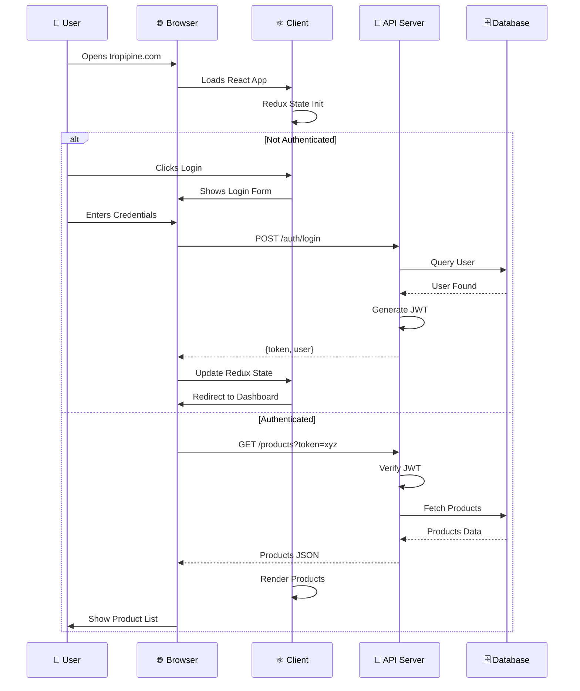
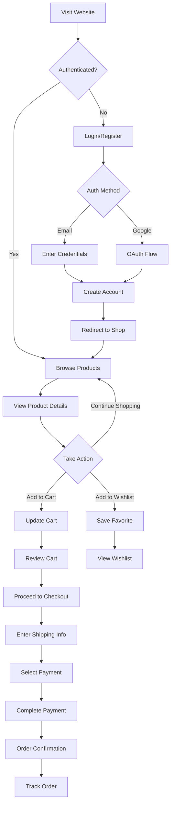
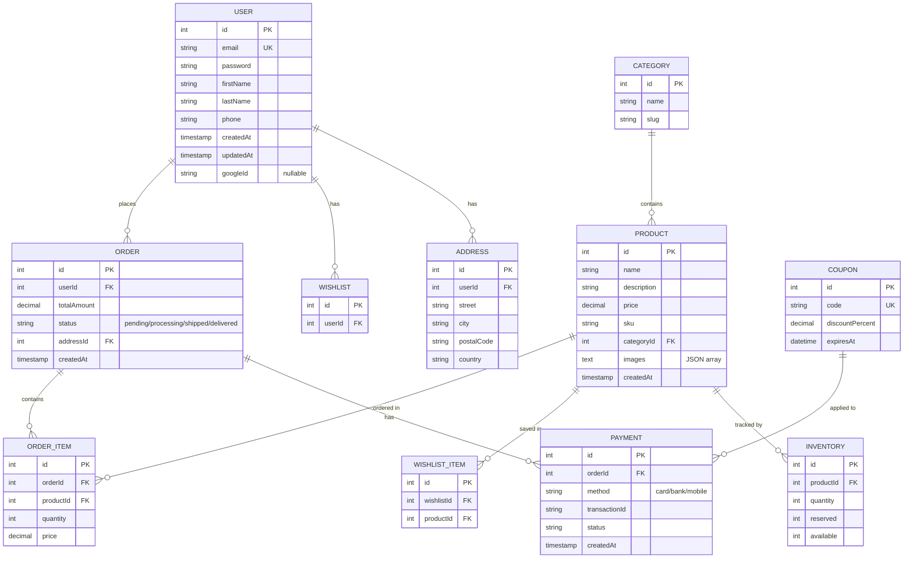

# 🍍 TropiPine - Premium Tropical Fruits E-Commerce Platform

> Premium tropical fruits delivered farm-fresh to your door. Handpicked. Always fresh.

An end-to-end e-commerce platform specializing in tropical fruit delivery with admin dashboard, customer portal, and comprehensive order management system.

## 📋 Table of Contents

- [Overview](#overview)
- [Project Architecture](#project-architecture)
- [Features](#features)
- [Tech Stack](#tech-stack)
- [System Architecture](#system-architecture)
- [User Flow](#user-flow)
- [Database Schema](#database-schema)
- [Directory Structure](#directory-structure)
- [Setup & Installation](#setup--installation)

---

## 🎯 Overview

TropiPine is a full-stack e-commerce solution designed for selling premium tropical fruits online. The platform includes:

- **Customer-facing frontend** with product browsing, wishlist, cart, and checkout
- **Admin dashboard** for inventory, order, and analytics management
- **Backend API** with secure authentication and payment processing
- **Real-time inventory management** and order tracking

### Key Statistics

- **3 main applications**: Client, Admin, Server
- **10+ product pages** with hero sections and modern UI
- **Complete auth flow**: Email/Password + Google Sign-In
- **Responsive design**: Mobile-first, Desktop optimized

---

## 🏗️ Project Architecture

```
┌─────────────────────────────────────────────────────────────┐
│                    TropiPine Platform                        │
├─────────────────────────────────────────────────────────────┤
│                                                               │
│  ┌──────────────────┐  ┌──────────────────┐  ┌──────────────┐
│  │  Client (React)  │  │ Admin (React)    │  │  Mobile WIP  │
│  │  Port: 5174      │  │ Port: 5175       │  │              │
│  │  Features:       │  │ Features:        │  │              │
│  │  - Shop          │  │ - Dashboard      │  │              │
│  │  - Auth          │  │ - Inventory      │  │              │
│  │  - Cart/Checkout │  │ - Orders         │  │              │
│  │  - Profile       │  │ - Analytics      │  │              │
│  └────────┬─────────┘  └────────┬─────────┘  └──────────────┘
│           │                     │
│           └──────────┬──────────┘
│                      │
│           ┌──────────▼──────────┐
│           │   Backend API       │
│           │   (Node.js/Express) │
│           │   Port: 3000        │
│           │                     │
│           │  • /auth            │
│           │  • /products        │
│           │  • /orders          │
│           │  • /users           │
│           │  • /payments        │
│           │  • /admin           │
│           └──────────┬──────────┘
│                      │
│           ┌──────────▼──────────┐
│           │   PostgreSQL DB     │
│           │   Prisma ORM        │
│           │                     │
│           │  • Users            │
│           │  • Products         │
│           │  • Orders           │
│           │  • Payments         │
│           │  • Inventory        │
│           └─────────────────────┘
│
└─────────────────────────────────────────────────────────────┘
```

---

## ✨ Features

### 🛍️ Customer Features

- **Product Browsing**
  - Browse all tropical fruits with detailed information
  - Filter by category (Fresh, Tropical, Exotic)
  - Product gallery with multiple images
  - Detailed product descriptions and pricing

- **Account Management**
  - Email/Password registration and login
  - Google Sign-In integration
  - User profile with order history
  - Wishlist management

- **Shopping Experience**
  - Add products to cart/wishlist
  - Quick checkout process
  - Multiple payment methods
  - Order tracking

- **Modern UI/UX**
  - Responsive design (mobile-first)
  - Smooth animations with Framer Motion
  - Dark gradient backgrounds
  - Modern card-based layouts

### 🎛️ Admin Features

- **Dashboard**
  - Sales overview and analytics
  - Real-time order status
  - Inventory levels

- **Inventory Management**
  - Add/Edit/Delete products
  - Manage stock levels
  - Product categorization

- **Order Management**
  - View all orders
  - Update order status
  - Track shipments

- **Customer Analytics**
  - User statistics
  - Sales trends
  - Popular products

- **Coupons & Promotions**
  - Create discount codes
  - Manage campaigns
  - Track redemptions

---

## 💻 Tech Stack

### Frontend

```mermaid
graph LR
    A["React 18.3"] --> B["Vite 5.4.21"]
    A --> C["Tailwind CSS"]
    A --> D["Framer Motion"]
    A --> E["Redux Toolkit"]
    B --> F["Dev Server"]
    C --> G["Custom Colors"]
    D --> H["Animations"]
    E --> I["State Mgmt"]
    
    style A fill:#61dafb
    style B fill:#764abc
    style C fill:#06b6d4
    style D fill:#000
    style E fill:#764abc
```



### Backend

```mermaid
graph LR
    A["Node.js"] --> B["Express.js"]
    B --> C["JWT Auth"]
    B --> D["Prisma ORM"]
    D --> E["PostgreSQL"]
    B --> F["RESTful API"]
    C --> G["Secure Routes"]
    
    style A fill:#339933
    style B fill:#000000
    style E fill:#336791
    style D fill:#2d3748
```



### Key Technologies

| Layer | Technology | Version |
|-------|-----------|---------|
| **Frontend Framework** | React | 18.3.1 |
| **Build Tool** | Vite | 5.4.21 |
| **Styling** | Tailwind CSS | Latest |
| **Animations** | Framer Motion | 11.x |
| **State Management** | Redux Toolkit | Latest |
| **Authentication** | Google OAuth | v2 |
| **Backend** | Node.js + Express | 18+ |
| **Database** | PostgreSQL | 12+ |
| **ORM** | Prisma | Latest |
| **Authentication** | JWT | RS256 |

---

## 🔄 System Architecture

### Request Flow



### User Journey



---

## 🗄️ Database Schema



---

## 📁 Directory Structure

```
tropipine/
├── README.md                          # Project documentation
├── PROJECT_COMPLETION_GUIDE.md        # Completion checklist
├── FEATURES_STATUS.md                 # Feature status tracker
├── PROJECT_STATUS_REPORT.md           # Status report
├── TropiPine_Project_Plan.md          # Project plan
│
├── tropipine-client/                  # 👤 Customer Frontend
│   ├── package.json
│   ├── vite.config.js
│   ├── tailwind.config.cjs
│   ├── index.html
│   ├── src/
│   │   ├── main.jsx                   # Entry point
│   │   ├── App.jsx                    # Main component
│   │   ├── components/
│   │   │   ├── Navbar.jsx             # Navigation bar
│   │   │   ├── Footer.jsx             # Footer
│   │   │   ├── ProductCard.jsx        # Product display
│   │   │   ├── PrivateRoute.jsx       # Protected routes
│   │   │   ├── GoogleSignIn.jsx       # OAuth component
│   │   │   ├── AuthInitializer.jsx    # Auth setup
│   │   │   └── ScrollToTop.jsx        # Scroll helper
│   │   ├── pages/
│   │   │   ├── Home.jsx               # Landing page
│   │   │   ├── Shop.jsx               # Product listing
│   │   │   ├── ProductDetail.jsx      # Single product
│   │   │   ├── Gallery.jsx            # Image gallery
│   │   │   ├── About.jsx              # About page
│   │   │   ├── Contact.jsx            # Contact form
│   │   │   ├── Login.jsx              # ✨ Modern two-column design
│   │   │   ├── Register.jsx           # ✨ Modern two-column design
│   │   │   ├── Cart.jsx               # Shopping cart
│   │   │   ├── Checkout.jsx           # Payment flow
│   │   │   ├── MyOrders.jsx           # Order history
│   │   │   ├── OrderTracking.jsx      # Track orders
│   │   │   ├── Profile.jsx            # User profile
│   │   │   ├── Wishlist.jsx           # Saved items
│   │   │   └── TrackOrder.jsx         # Order details
│   │   ├── services/
│   │   │   └── api.js                 # Axios config
│   │   ├── store/
│   │   │   ├── index.js               # Redux store
│   │   │   └── slices/                # Redux slices
│   │   └── styles/
│   │       └── index.css              # Global styles
│   └── public/                        # Static assets
│
├── tropipine-admin/                   # 🎛️ Admin Dashboard
│   ├── package.json
│   ├── vite.config.js
│   ├── tailwind.config.js
│   ├── eslint.config.js
│   ├── index.html
│   ├── src/
│   │   ├── main.jsx
│   │   ├── App.jsx
│   │   ├── components/
│   │   │   └── AdminLayout.jsx        # Admin layout wrapper
│   │   ├── pages/
│   │   │   ├── AdminLoginPage.jsx     # Admin auth
│   │   │   ├── DashboardPage.jsx      # Overview
│   │   │   ├── ProductsPage.jsx       # Inventory
│   │   │   ├── OrdersPage.jsx         # Order mgmt
│   │   │   ├── CustomersPage.jsx      # User mgmt
│   │   │   ├── PaymentsPage.jsx       # Payment tracking
│   │   │   ├── AnalyticsPage.jsx      # Reports
│   │   │   ├── CouponsPage.jsx        # Promotions
│   │   │   ├── GalleryPage.jsx        # Media
│   │   │   └── SettingsPage.jsx       # Configuration
│   │   ├── store/
│   │   │   ├── index.js               # Redux store
│   │   │   └── authSlice.js           # Auth state
│   │   ├── utils/
│   │   │   └── api.js                 # API calls
│   │   └── styles/
│   │       └── index.css
│   └── public/
│
└── tropipine-server/                  # 🔌 Backend API
    ├── package.json
    ├── README.md
    ├── src/
    │   ├── server.js                  # Express app
    │   ├── config/
    │   │   └── db.js                  # Database config
    │   ├── controllers/               # Route handlers
    │   │   ├── auth.controller.js
    │   │   ├── product.controller.js
    │   │   ├── order.controller.js
    │   │   ├── user.controller.js
    │   │   ├── payment.controller.js
    │   │   ├── cart.controller.js
    │   │   ├── wishlist.controller.js
    │   │   ├── address.controller.js
    │   │   ├── coupon.controller.js
    │   │   ├── analytics.controller.js
    │   │   └── admin.controller.js
    │   ├── middleware/                # Custom middleware
    │   │   ├── auth.js                # JWT verification
    │   │   └── validation.js          # Input validation
    │   ├── routes/                    # API endpoints
    │   ├── services/                  # Business logic
    │   ├── utils/                     # Helper functions
    │   ├── prisma/                    # Database
    │   │   ├── schema.prisma          # Data model
    │   │   ├── seed.js                # Seed data
    │   │   └── migrations/            # DB migrations
    │   └── generated/                 # Prisma generated
    └── scripts/
        └── smoke.js                   # Testing script
```

---

## 🚀 Setup & Installation

### Prerequisites

- Node.js 18+
- PostgreSQL 12+
- npm or yarn
- Git

### Installation Steps

#### 1️⃣ Clone Repository

```bash
git clone https://github.com/yourusername/tropipine.git
cd tropipine
```

#### 2️⃣ Setup Backend

```bash
cd tropipine-server

# Install dependencies
npm install

# Setup environment variables
cp .env.example .env
# Edit .env with your database credentials

# Run migrations
npx prisma migrate dev

# Seed database (optional)
npm run seed

# Start server
npm run dev
# Server runs on http://localhost:3000
```

#### 3️⃣ Setup Client

```bash
cd tropipine-client

# Install dependencies
npm install

# Setup environment variables
cp .env.example .env
# Add API_URL=http://localhost:3000
# Add VITE_GOOGLE_CLIENT_ID=your_google_client_id

# Start dev server
npm run dev
# Client runs on http://localhost:5174
```

#### 4️⃣ Setup Admin

```bash
cd tropipine-admin

# Install dependencies
npm install

# Setup environment variables
cp .env.example .env
# Add VITE_API_URL=http://localhost:3000

# Start dev server
npm run dev
# Admin runs on http://localhost:5175
```

### Build for Production

```bash
# Client
cd tropipine-client
npm run build
# Output: dist/

# Admin
cd tropipine-admin
npm run build
# Output: dist/

# Server
cd tropipine-server
npm run build
npm start
```

---

## 📊 API Endpoints

### Authentication
- `POST /auth/register` - Register new user
- `POST /auth/login` - Login with email/password
- `POST /auth/google` - Google OAuth sign-in
- `POST /auth/refresh` - Refresh JWT token
- `POST /auth/logout` - Logout user

### Products
- `GET /products` - List all products
- `GET /products/:id` - Get product details
- `POST /products` - Create product (admin)
- `PUT /products/:id` - Update product (admin)
- `DELETE /products/:id` - Delete product (admin)

### Orders
- `GET /orders` - User's orders
- `POST /orders` - Create order
- `GET /orders/:id` - Order details
- `PUT /orders/:id` - Update order status (admin)

### Users
- `GET /users/profile` - Current user profile
- `PUT /users/profile` - Update profile
- `GET /users/:id` - User details (admin)

### Payments
- `POST /payments` - Process payment
- `GET /payments/:orderId` - Payment details

### Cart & Wishlist
- `GET /cart` - View cart
- `POST /cart` - Add to cart
- `DELETE /cart/:itemId` - Remove from cart
- `GET /wishlist` - View wishlist
- `POST /wishlist` - Add to wishlist

---

## 🎨 UI/UX Features

### Modern Design System

- **Brand Colors**: Orange gradients, dark backgrounds, white cards
- **Animations**: Smooth fade-ins, hover effects, scale transforms
- **Typography**: Bold headings, readable body text
- **Responsive**: Mobile-first, Desktop-optimized
- **Accessibility**: Semantic HTML, ARIA labels, keyboard navigation

### Component Highlights

- ✨ **Login/Register**: Two-column layout with animated gradients
- 📱 **Responsive Grid**: Products display in 1-4 columns based on screen size
- 🎬 **Smooth Animations**: Framer Motion transitions and effects
- 🌙 **Dark Theme**: Brand-consistent dark gradients with contrasting text
- ♿ **Accessible**: Proper contrast, keyboard support, semantic markup

---

## 📈 Project Status

| Component | Status | Version |
|-----------|--------|---------|
| **Client Frontend** | ✅ Complete | v1.0 |
| **Admin Dashboard** | ✅ Complete | v1.0 |
| **Backend API** | ✅ Complete | v1.0 |
| **Database** | ✅ Complete | v1.0 |
| **Authentication** | ✅ Complete | v1.0 |
| **Product Management** | ✅ Complete | v1.0 |
| **Order System** | ✅ Complete | v1.0 |
| **Payment Integration** | ⏳ In Progress | v0.9 |
| **Mobile App** | 📋 Planned | - |

---

## 📝 License

MIT License - see LICENSE file for details

## 🤝 Contributing

Contributions welcome! Please follow our coding standards and submit pull requests.

## 📧 Contact

- Email: info@tropipine.com
- Phone: +880 1234-567890
- Location: Dhaka, Bangladesh

---

**Made with 🍍 by TropiPine Team**
